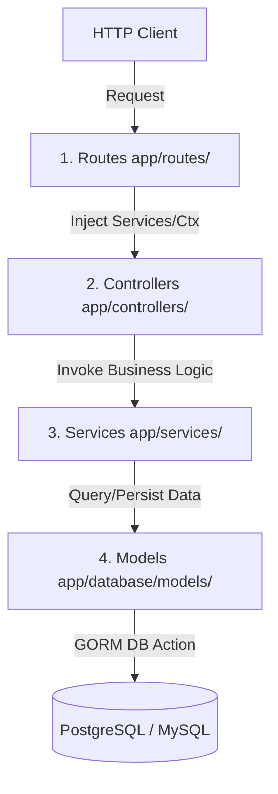

# Fiberplate

A robust, layered boilerplate for building REST APIs using Go and the Fiber framework. Uses GORM (supporting PostgreSQL or MySQL) for ORM operations and Auto-Migrations.

---

## 🏗 Architecture & Project Structure

This project enforces a clean, layered architectural pattern. Each request flows sequentially through the layers below:



### Directory Outline

```text
├── main.go               # Development entry point (starts server, generates Swagger)
├── makefile              # Standard command automation (run, build, test)
├── go.mod                # Go module metadata & dependencies
├── app/
│   ├── app.go            # Fiber application bootstrap & setup (middleware, swagger)
│   ├── common/           # Domain constants, error codes, and shared models
│   ├── controllers/      # Handlers: request decoding, response validation, code mapping
│   ├── database/         # DB connection setup and GORM initializers
│   │   └── models/       # Entity struct definitions
│   ├── middleware/       # Global/Route middlewares & structural DI container
│   ├── routes/           # Endpoint grouping, route mappings, & auth interceptors
│   ├── services/         # Core business workflows & repository actions
│   └── utils/            # Helper utils (crypto, env, custom log formatter)
└── docs/                 # Swagger Auto-generated specification files
```

---

## 🚀 Getting Started

### 1. Prerequisites
Ensure you have Go installed (version `1.18+` recommended).

### 2. Configure Environment
Copy the example environment template and modify it for your database configuration:
```bash
cp .env.example .env
```

### 3. Run the Server
Use the Makefile command to generate/update the Swagger documentation and start the server:
```bash
make run
```
*The server will start running on the port specified by `BASE_URL` in `.env` (default is `localhost:3000`).*

### 4. Interactive Documentation
Swagger documentation is generated automatically on run.
Access it at: `http://localhost:3000/api/swagger/index.html`

---

## 🛠 Command Reference

- **`make run`**: Run Swagger documentation generator and start application server.
- **`make build`**: Compile the application into a executable binary inside `./bin/app`.
- **`make test`**: Run the test suite with coverage visualization.

---

## 🤝 Contribution Guidelines

Please read [CONTRIBUTING.md](./CONTRIBUTING.md) to understand how to add new endpoints, structures, and controllers correctly without disrupting architectural patterns.
